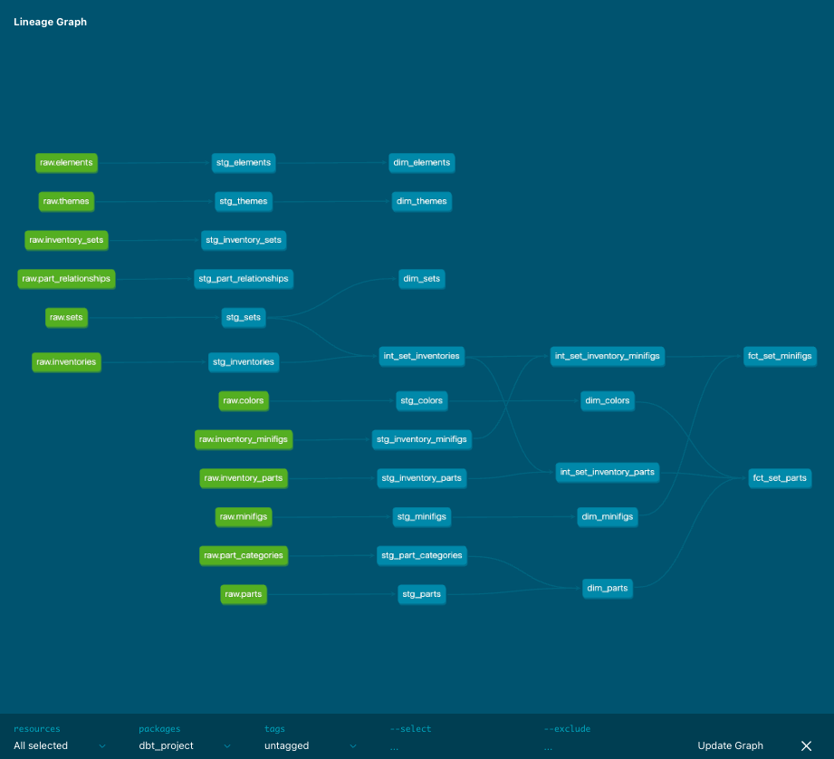

# Rebrickable ELT Pipeline

An end-to-end ELT pipeline using Rebrickable LEGO catalog data.

The project extracts Rebrickable CSV datasets using Python, loads the raw data into PostgreSQL, and transforms the data using dbt.

## Tech Stack

* Python
* PostgreSQL
* SQL
* dbt

## Pipeline

```text
Rebrickable CSV Files
        ↓
Python Extraction
        ↓
PostgreSQL Raw Layer
        ↓
dbt Staging Models
        ↓
dbt Intermediate Models
        ↓
dbt Dimensions and Facts
````

## Project Structure

```text
rebrickable-elt-pipeline/
├── data/
├── dbt_project/
│   └── models/
│       ├── staging/
│       ├── intermediate/
│       └── marts/
│           ├── dimensions/
│           └── facts/
├── logs/
├── sql/
│   └── raw_ddl.sql
├── src/
│   ├── config.py
│   ├── extract.py
│   └── load.py
├── .env.example
├── .gitignore
├── dbt-lineage.png
├── README.md
└── requirements.txt
```


# ETL

## Extract

The extraction script downloads the Rebrickable datasets as compressed CSV files.
* Downloads the required Rebrickable datasets
* Decompresses the `.csv.gz` files
* Stores the CSV files locally for loading into PostgreSQL

Datasets used:
* colors
* elements
* inventories
* inventory_minifigs
* inventory_parts
* inventory_sets
* minifigs
* part_categories
* part_relationships
* parts
* sets
* themes

Run:

```bash
python src/extract.py
```

---

## Load

The loading script creates the raw PostgreSQL tables and loads the extracted CSV files.

The raw layer keeps the source data as close as possible to the original Rebrickable data, with all columns initially loaded as text.

Run:

```bash
python src/load.py
```

---

## Transform

The transformation layer uses dbt.

The project follows this structure:

```text
raw
 ↓
staging
 ↓
intermediate
 ↓
marts
```


# dbt

## Staging

The staging models convert the data types and rename columns.

Examples:

```text
stg_sets
stg_parts
stg_colors
stg_minifigs
stg_inventories
stg_inventory_parts
stg_inventory_minifigs
```

The staging layer also includes dbt tests for:

* `not_null`
* `unique`
* `relationships`

Some relationship tests are configured as warnings instead of error because of confirmed inconsistencies in the Rebrickable source data.

---

## Intermediate

The intermediate layer joins LEGO sets to their inventories and then connects them to inventory parts and inventory minifigs.

```text
int_set_inventories
├── int_set_inventory_parts
└── int_set_inventory_minifigs
```

### `int_set_inventories`

Connects sets to their inventory records and identifies the latest inventory version.

### `int_set_inventory_parts`

Connects sets and inventory versions to their included parts.

### `int_set_inventory_minifigs`

Connects sets and inventory versions to their included minifigures.

---

## Marts

The final layer contains analytics-ready dimension and fact models.

### Dimensions

```text
dim_colors
dim_elements
dim_minifigs
dim_parts
dim_sets
dim_themes
```

These models contain descriptive information about LEGO entities.

For example:
* `dim_parts` contains part and category information
* `dim_colors` contains color attributes
* `dim_sets` contains set information
* `dim_themes` contains theme information
* `dim_minifigs` contains minifigure information

---

### Facts

```text
fct_set_parts
fct_set_minifigs
```

#### `fct_set_parts`

Contains the parts included in LEGO sets.

Includes:
* Set number
* Inventory ID and version
* Part number and name
* Color ID and name
* Quantity
* Spare part indicator
* Latest inventory version indicator

#### `fct_set_minifigs`

Contains the minifigures included in LEGO sets.

Includes:
* Set number
* Inventory ID and version
* Minifigure number and name
* Quantity
* Latest inventory version indicator

The inventory version information is preserved so historical inventory versions can still be analyzed.

For the latest version of a set inventory:

```sql
SELECT *
FROM dbt.fct_set_parts
WHERE is_latest_version = TRUE;
```

---

## dbt Lineage

The dbt lineage shows how the Rebrickable data flows from the raw layer through staging, intermediate models, and final marts.



The main transformation flow joins sets to their inventory records before building separate models for set parts and set minifigures.

Some staging models go directly into dimension models because they mainly contain descriptive information about a LEGO entity.

For example, `stg_colors` becomes `dim_colors`, `stg_parts` becomes `dim_parts`, and `stg_minifigs` becomes `dim_minifigs`.

The dimension models are then used to add more information to the final fact models. For example, `dim_parts` and `dim_colors` are joined to `fct_set_parts` to include part and color names, while `dim_minifigs` is joined to `fct_set_minifigs` to include minifigure names.

Other datasets, such as `part_relationships`, are also staged but are not currently used in the final models.

---

# Data Quality

dbt tests are used throughout the transformation layer to validate:

* Required values
* Unique identifiers
* Relationships between datasets

Known inconsistencies in the Rebrickable source data are configured as warnings instead of failing the entire pipeline.

Run the full dbt pipeline:

```bash
cd dbt_project
dbt build
```

---

# Setup

## 1. Clone the repository

```bash
git clone [<repository-url>](https://github.com/silvallana/rebrickable-elt-pipeline.git)
cd rebrickable-elt-pipeline
```

## 2. Create a virtual environment

```bash
python -m venv .venv
source .venv/bin/activate
```

## 3. Install dependencies

```bash
pip install -r requirements.txt
```

## 4. Configure PostgreSQL

Create a `.env` file based on `.env.example`.

```text
PG_HOST=
PG_PORT=
PG_DATABASE=
PG_USER=
PG_PASSWORD=
```

## 5. Run the pipeline

Extract:

```bash
python src/extract.py
```

Load:

```bash
python src/load.py
```

Transform and test:

```bash
cd dbt_project
dbt build
```
